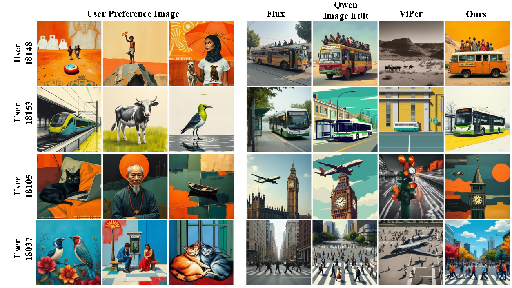

# Premier



<br>
<a href="https://github.com/120L020904/Premier"></a>
<!-- <a href="https://huggingface.co/datasets/Yuanshi/Subjects200K"></a> -->
<a href="https://arxiv.org/abs/2603.20725"></a>


> **Premier: Personalized Preference Modulation with Learnable User Embedding in Text-to-Image Generation**
> <br>
> Zihao Wang, Yuxiang Wei, Xinpeng Zhou, Tianyu Zhang, Tao Liang, Yalong Bai, Hongzhi Zhang, Wangmeng Zuo
> <br>
> Harbin Institute of Technology, Duxiaoman
> <br>

## Features

- 🧩 **Learnable User Embedding**
Initializes an independent trainable vector for each user, jointly optimized via the diffusion model’s Flow Matching Loss and Dispersion Loss, ensuring that the user preference embeddings naturally align with the text-to-image model’s representation distribution while effectively distinguishing and separating different user preferences.
- 🚀**Prompt Preference Modulation (PPM)**
Dynamically generates a context-aware modulation direction for each text token, enabling fine-grained, semantically aligned preference injection.
- 📝 **Strong Text Instruction-Following**: Compared to full-parameter/low-rank fine-tuning methods like LoRA, Premier injects preferences while minimally compromising the base model's ability to parse and generate from complex prompts.
- 📊 **Lightweight & Efficiency**
  - 💾 **Minimal Storage**: Single-user preference embedding occupies only ~61 KB
  - ⚡ **Zero-Cost Inference**: Adds only ~1 second inference overhead, independent of resolution.
  - ⏱️ **Fast Training**: Single-user adaptation takes approximately 30 minutes.
## Quick Start
### Setup 
1. **Environment setup**
```bash
conda create -n premier python=3.12
conda activate premier
```
2. **Requirements installation**
```bash
pip install -r requirements.txt
```
### Data Preparation
The training data should be saved as a `.pkl` file containing a **list of users**.  
Each user is represented as a **list of entries**, where:

- Each **entry (except the last one)** corresponds to a preference image and consists of:
  ```python
  [image_path: str, input_text_prompt: str]
- The last entry contains auxiliary user metadata (not used during training).
  ```python
  [
    # User 0
    [
        ["./data/user0/img1.jpg", "a cute cat sitting on a windowsill"],
        ["./data/user0/img2.jpg", "a dog playing in the park with a red ball"],
        # ... more image-text pairs ...
        {"user_id": "user0",}  # unused in training
    ],
    # ... more users ...
  ]
During training of user preference embeddings, the data must be split into **historical (training) samples** and **test samples**. The resulting splits are saved as CSV files with the following column names:

-  `positive_image`: Path to the user's preferred image  
- `caption`: Text prompt or description provided by the user for that image
  

### Usage example
```shell
  # train preference adapter
  ./monitor_pid.sh
  # train user embedding by linear combination
  ./monitor_pid_user_linear.sh
  # direct training user embedding
  ./monitor_pid_user.sh
  # generate images
  ./monitor_pid_generate.sh
```
## Generated samples


<div float="center">
  
  
</div>

## Models

Model weights are about to be uploaded.


## To-do
- [ ] Release the model weights.

## Acknowledgment
The work was supported by National Natural Science Foundation of China under Grant No.62371164.
Thanks to the outstanding work of [OminiControl](https://github.com/Yuanshi9815/OminiControl) and [XVerse](https://github.com/bytedance/XVerse), and to the data provided by [PrefGen](https://prefgen.github.io/).
## Citation
```
@article{wang2026premier,
  title={Premier: Personalized Preference Modulation with Learnable User Embedding in Text-to-Image Generation},
  author={Wang, Zihao and Wei, Yuxiang and Zhou, Xinpeng and Zhang, Tianyu and Liang, Tao and Bai, Yalong and Zhang, Hongzhi and Zuo, Wangmeng},
  journal={arXiv preprint arXiv:2603.20725},
  year={2026}
}
```
